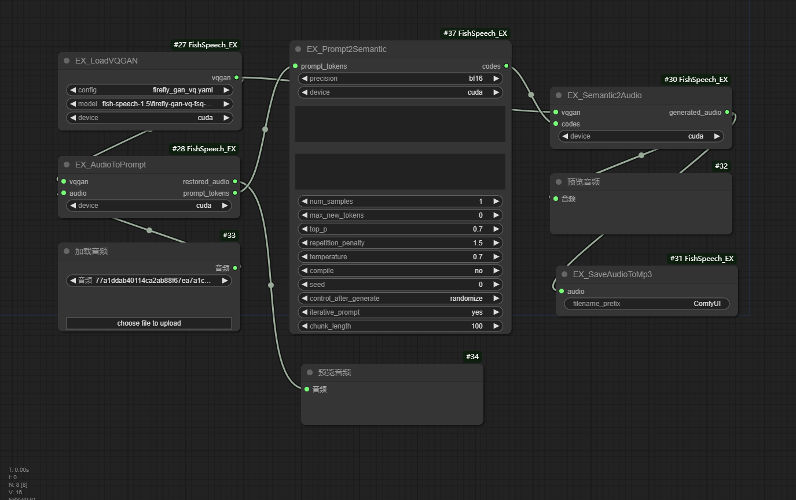

[English](README.md) | [简体中文](README_zh_CN.md)

# ComfyUI_Hunyuan3D_EX

This plugin is optimized for Fish-Speech-1.5 version and is only applicable to version 1.5:
1. The plugin references the ComfyUI-fish-speech plugin for optimization, and modifies the overall configuration address and installation method.
2. The required Python libraries for the plugin have been improved, mainly vector-quantize-pytorch. If this library is not installed, the audio quality will be poor. `This problem has been bothering me for a few days, and I searched the entire FishSpeech plugin to find the sampling step issue. If this problem has also been bothering you, please give it a like, thank you!`

#### Specific nodes：

- **EX_AudioToPrompt**
1. **audio**: ComfyUI audio.
2. **vqgan**: VQGAN model.
3. **restored_audio**: Decoded audio.
4. **prompt_tokens**: Tokens corresponding to the prompt audio.

- **EX_Prompt2Semantic**
1. **prompt_tokens**: The token corresponding to the input prompt audio.
2. **codes**: The generated audio Code.

- **EX_LoadVQGAN**
Load the VQGAN model, input the model path, and output the model.

- **EX_Semantic2Image**
Analyze audio Code, output corresponding audio.

- **EX_SaveAudioToMp3**
Save the audio to an MP3 file.

## Work flow

## Reference materials
- [AnyaCoder/ComfyUI-fish-speech](https://github.com/AnyaCoder/ComfyUI-fish-speech) - Official Implementaion
- [fishaudio/fish-speech](https://github.com/AnyaCoder/ComfyUI-fish-speech) - SOTA Open Source TTS.

